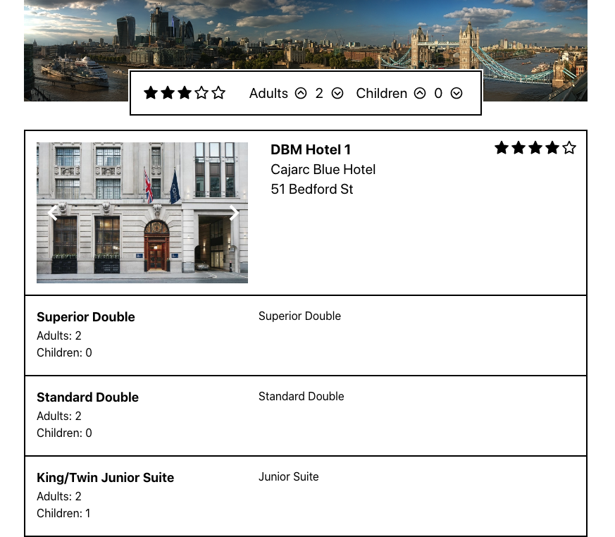

# Getting Started with Hotel App

This project was bootstrapped with [Create React App](https://github.com/facebook/create-react-app).

## Available Scripts

In the project directory, you can run:

- `yarn` to install all dependencies
- `yarn start` to view project at [http://localhost:3000](http://localhost:3000) in the browser.
- `yarn test` to run tests

# API

- Hotels: `https://obmng.dbm.guestline.net/api/hotels?collection-id=OBMNG`
- Rooms: `https://obmng.dbm.guestline.net/api/roomRates/OBMNG/[hotelId]`

## Requirements

- Filter on the star rating
- Filter on capacity of the room, adults and/or children
- View all images of the hotel
- View details for hotel: name, address, rating and room: type, max adults/children, description
- See mockup for additional

## Screenshot

Completed MVP

Mockup

